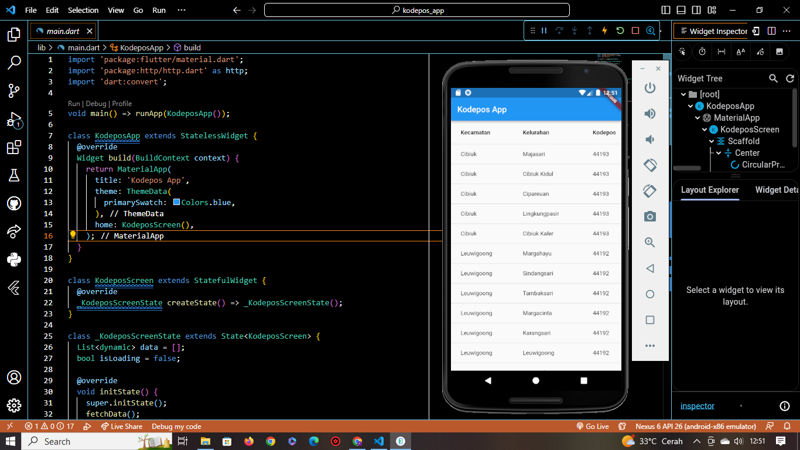

## Nama : Prananda Aditya

## Nim : 312010130

## kelas : TI.20.A1

# Pengenalan tentang aplikasi kode pos

Aplikasi kode pos ini adalah sebuah aplikasi yang di rancang untuk membantu pengguna dalam mencari, menemukan, dan memperoleh informasi tentang kode pos suatu daerah atau lokasi tertentu kode pos digunakan sebagai sistem penomoran yang mempermudah proses pengiriman surat atau paket pos ke alamat yang tepat.

# Source Code dan hasil

